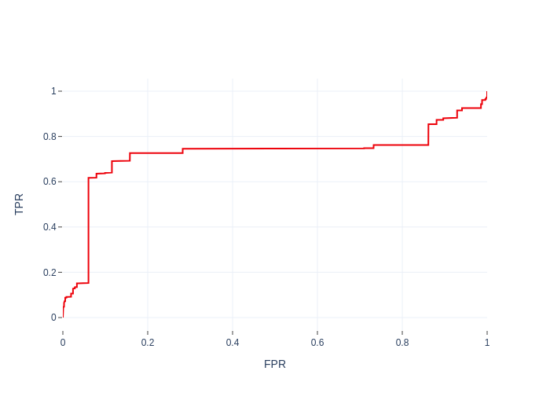

# Installation

1. Install docker

2. Clone this repository and navigate to the project directory

# Basic usage

1. Build docker container:

```bash
sudo docker build . -t <tag_name>
```

2. Push the container to the docker hub:

```bash
sudo docker push <tag_name>
```

3. Create a client-server couple of containers as follows:

```bash
sudo docker run -dt --name server <tag_name>
sudo docker run -dt --name client <tag_name>
```

4. Finally, start traffic generation using the new containers:

```bash
sudo docker exec -dt server "python3 servber.py -m <mode> -t <traffic type>"
sudo docker exec -dt server "python3 client.py -m <mode> -t <traffic type> -r <server's ip>"
```

5. You can test traffic generated against classifiers trained in the previous stage:

```bash
python3 test_traffic_against_classifier.py -i <generated pcap files> -m <classifier models>
```

#### Classification based on flow features:

   

#### Classification based on payload features (n-grams):

   
